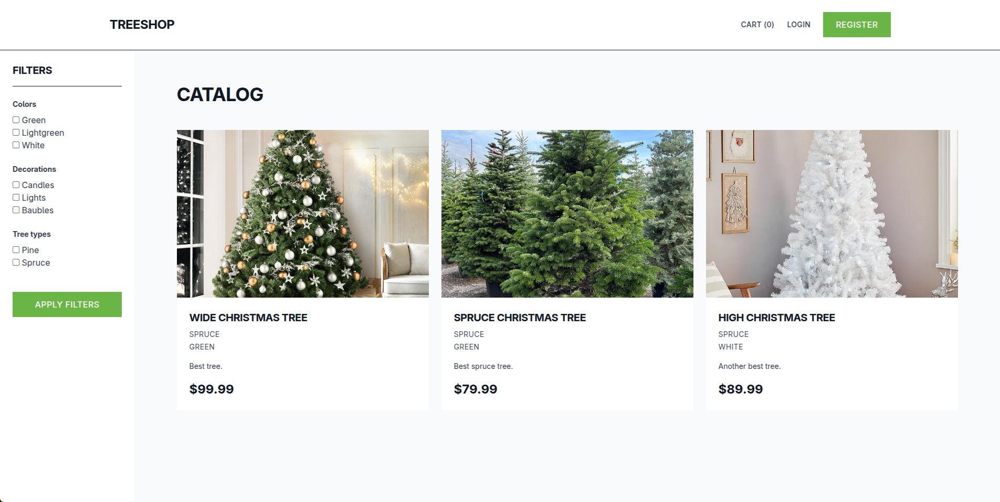
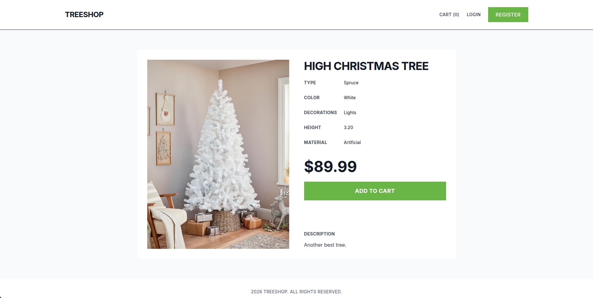
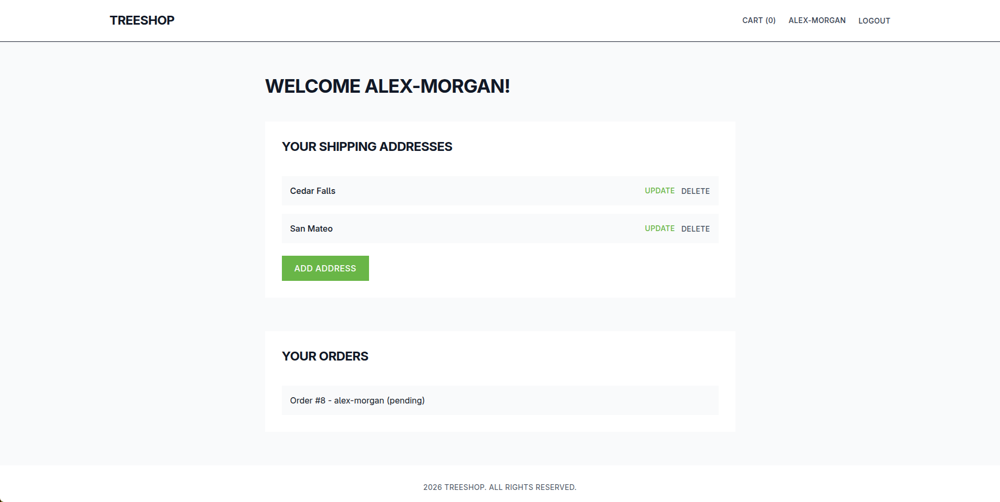
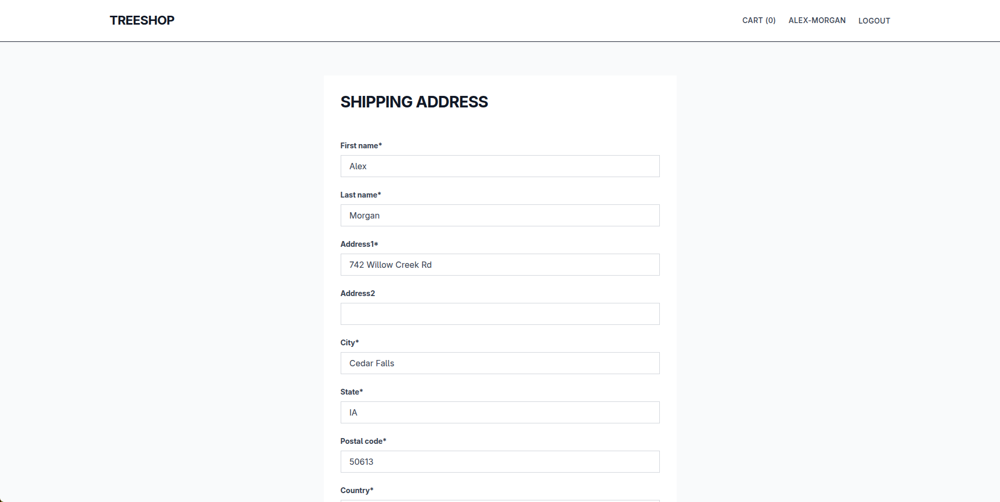
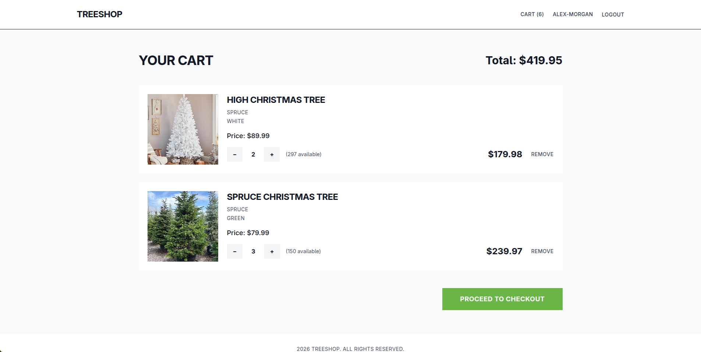
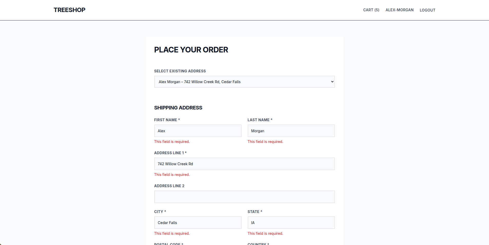

# TreeShop



E-commerce site built with Django, designed for selling Christmas trees and decorations. A functional shop with a shopping cart, user accounts, and product management.

## Key Features
- **Curated Tree Selection**: Browse Christmas trees and premium artificial options with complete specifications.
- **Detailed Product Info**: Each listing displays height range, tree type, color variants, and pre-applied decoration packages.
- **Smart Shopping Cart**: Add items with quantity selection, review cart totals, and modify selections before checkout.
- **User Accounts**: Register to save preferences, view full order history, and store multiple shipping addresses.
- **Streamlined Checkout**: Multi-step order placement with address validation and order confirmation.
- **Mobile-Optimized**: Fully responsive design using Tailwind CSS for seamless shopping on desktop and mobile devices.

## Technologies Used
- **Backend**: Python, Django 6.0
- **Database**: SQLite (Default)
- **Frontend**: HTML5, Tailwind CSS, Crispy Forms
- **Utilities**: Pillow (Image processing), Environs (Environment variables)

## Quick Start

### Prerequisites
- Python 3.10+

### Installation

1. **Install dependencies**
   ```bash
   pip install -r requirements.txt
   ```

2. **Configure Environment**
   Create a `.env` file in the root directory. You can use the example below:
   ```env
   # .env
   DEBUG=True
   SECRET_KEY=your_secret_key
   ```

3. **Run Migrations & Server**
   ```bash
   python manage.py migrate
   python manage.py runserver
   ```

4. **Visit** `http://127.0.0.1:8000` to browse the shop.

## Screenshots

### Home Page


### Product Listing


### Shopping Cart


### User Dashboard


### Checkout / Orders


### Product Details
